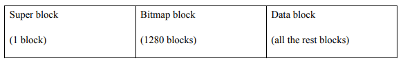

# 一个用户级文件系统的设计

姓名：黄智权
学号：201836580388
班级：2018级计科1班
电话：15622168075
电子邮件：tootal@yeah.net
QQ：1521156925

## 课程设计的主要目的

使用FUSE框架实现一个用户态文件系统`ufs`。该文件系统为一个二级目录系统，包含以下限制：

* 根目录可以包含文件和子目录
* 子目录只能包含文件，不能包含目录
* 所有文件的权限为（0666）
* 不需要保存大部分文件属性（如创建时间和修改时间）
* 文件不能被截断
* 目录视作文件

`ufs`文件系统使用一个单独的磁盘文件来实现，磁盘文件分为若干个块，每块512个字节。磁盘文件的格式如下图所示：

超级块（Super block）作为文件系统的第一个块，用于描述整个文件系统。包含文件系统的大小、根目录块的位置、bitmap块的大小。

目录同样被视作文件，每个文件包含文件名、扩展名、文件大小、起始块、类型。文件存放在一个预分配大小的磁盘文件中，每一个磁盘块包含当前块中使用的字节数、下一块的编号以及数据。

为了维护磁盘中的空闲空间，需要使用bitmap块来记录每一块是否被占用。以一个5MB的磁盘文件为例，使用`dd bs=1K count=5K if=/dev/zero of=diskimg`可以创建一个初始化为0的名为`diskimg`的磁盘文件

为了实现文件系统的常用功能，还需要实现以下常用的系统调用：getattr、mknod、unlink、open、read、write、mkdir、rmdir、readdir。

代码使用Make工具进行构建，在目录下执行`make`命令即可编译程序。初始化磁盘后，可以使用`./mount -d /tmp/fuse`命令将`ufs`文件系统挂载到`/tmp/fuse`目录下。按Ctrl+C可以取消挂载文件系统。

## 相关的技术背景

文件系统是操作系统用于明确磁盘或分区上的文件的方法和数据结构，负责把用户的文件存到磁盘中，实现持久化的保存文件。文件系统的基本数据单位是文件，目的是对磁盘上的文件进行组织管理，组织的方式不同，就会形成不同的文件系统。磁盘通常会分成若干个逻辑块，每次读写的最小单位是逻辑块，这样可以大大提高磁盘读写的效率。磁盘通常会分成三个存储区域，分别是超级块、标记块、数据块。其中超级块用来存储文件系统的详细信息，标记块用来标记空闲块，数据块用来存储文件或目录数据。

FUSE（Filesystem in Userspace）是一个Linux内核扩展，允许在用户空间实现文件系统。fuse实现了一个对文件系统访问的回调。fuse分为内核态的模块和用户态的库两部分。其中用户态的库为程序开发提供接口，通过这些接口将请求处理功能注册到fuse中。内核态模块是具体的数据流程的功能实现，它截获文件的访问请求，然后调用用户态注册的函数进行处理。

## 主要思想和技术路线

根据文件系统的设计要求，文件系统包含一些常用的定义，代码位于`ufs.h`文件中。

文件系统的运行流程主要包含两个步骤：

1. 初始化磁盘文件
2. 挂载文件系统

### 初始化磁盘文件

首先调用`dd bs=1K count=5K if=/dev/zero of=diskimg`系统命令创建一个5MB的磁盘文件，然后按照设计要求依次初始化超级块、bitmap块、数据块。

超级块需要写入文件系统的大小、根目录的块编号以及bitmap的大小。bitmap块则需要将当前已使用的块标记。数据块添加默认的根目录数据块即可。

初始化代码位于`ufs_init.c`文件中，编译后在当前目录下运行`./ufs_init`即可初始化磁盘文件。

### 挂载磁盘文件

## 测试结果

## 源代码的目录结构及存放位置

## 运行环境

操作系统：openEuler 20.09

Linux内核版本：4.19.140

FUSE版本：2.9.9-2

GCC版本：9.3.1

